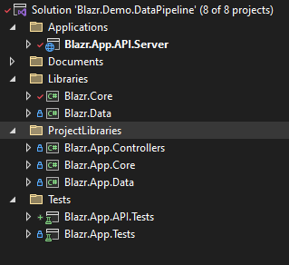
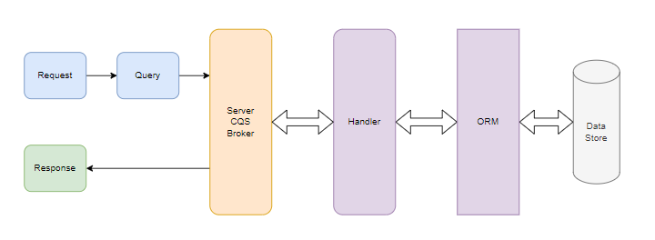
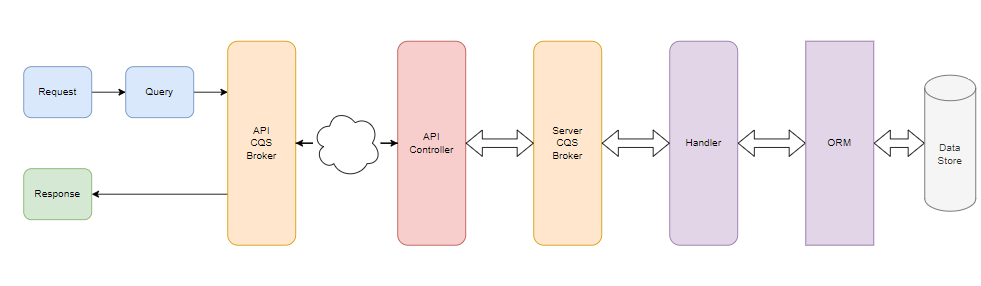

# Building A Generic CQS Data Pipeline

The CQS implementations I've seen have always looked incredibly verbose: the number of classes scared me. I recently had cause to revisit CQS on an application re-write and decided to work on creating a more succinct implementation. This article describes what I've achieved.

## Test Data

The Appendix provides a summary of the data classes and test data provider. There's a full description in the documents section of the repository.

There's a separate article in this series that describes the data store and pipeline used:

[The Weather Application Data Strore](./data.md)


## The CQS Pattern

CQS - not to be confused with CQRS - is fundimentally a programming style.  Every action is either:

1. A *Command* - a request to make a data change.
2. A *Query* - a request to get some data.

A *Command* returns either status information or nothing.  Commands **NEVER** return data.

A *Query* returns a data set.  Queries **NEVER** make changes to the state of the data.  Ther are no **NO SIDE EFFECTS** when you execute a query.

Good practice is to apply these rules to all object methods.  They make code more readable to the third person.

Smaller projects tend to avoid the CQS Data pipeline framework: it's seen as complicated because the demo implementations contain a lot of classes.

Each action has a Command/Query class that defines the action and a Handler class to execute the defined action. Normally, a one-to-one relationship: a unique handler for every request.

In essence:

- A `Request` object defines the information a Handler needs to execute the request and what it expects in return the Result.

- A `Handler` object executes the necessary code and returns the defined Result using data provided by the Request.

Conceptually, it's very simple, and relatively easy to implement. The problem is each database action requires a request and a handler object. Lots of classes defining and repeating the same old code.

## Solution Layout and Design

The solution consists of a set of libraries organised on Clean Design principles. It's designed to work in any DotNetCore environment. 

- *Blazr.Core* and *Blazr.Data* are the two base libraries that can be used for any implementation. 
- *Blazr.Demo.Core*, *Blazr.Demo.Data* and *Blazr.Demo.Controllers* are the three application specific libraries.
- *Blazr.App.Tests* and *Blazr.App.SPI.Tests* are the two test projects.
- *Blazr.App.API.Server* is the Web API solution.



I use it in Blazor projects.

## Base Interfaces

The basic methodology can be defined by two interfaces.

`IRequest` defines any request:

1. It says the request produces an output defined as `TResult`.
2. It has a unique `TransactionId` to track the transaction (if required and implemented).
3. It defines a cancellation token for passing down to the data layer.  We need to learn to live in an *async* world!

```csharp
public interface IRequestAync<out TResult>
{
    public Guid TransactionId { get;}
    public CancellationToken CancellationToken { get; }
}
```

`IHandler` defines any handler that executes an `IRequestAync` instance:

1. The handler gets a `TRequest` which implements the `IRequestAync` interface.
2. The handler outputs a `TResult` as defined in the `IRequestAync` interface.
3. It has a single `ExecuteAsync` method that returns `TResult`.

```csharp
public interface IHandlerAsync<in TRequest, out TResult>
    where TRequest : IRequestAsync<TResult>
{
    TResult ExecuteAsync();
}
```

To build a more succinct implementation we need to accept:

 - We must Accept the 80/20 rule. Not every request can be fulfilled with our standard implementation, but 80% is a lot of effort and classes to save on.
 - We need a methodology for the 20%.
 - We need a "compliant" generics based ORM to interface with our data store. This implementation uses Entity Framework which provides that.
 - Code some quite complicated generics in the base classes to abstract functionality into boilerplate code.

## The Server Pipeline

The server pipeline is shown below.



The API pipeline is adds the extra API layers.



## A Command Pipeline

An update command starts with the front end building an `UpdsteRecordCommand`

The interface defines:

1. A Command returns a `ValueTask<CommandResult>`
2. A single `Record` property defining the record the operation will be applied to.

```csharp
public interface IRecordCommand<TRecord> 
    : IRequestAsync<ValueTask<CommandResult>>
    where TRecord : class, new()
{
    public TRecord Record { get;}
}
```
```csharp
public abstract record RecordCommandBase<TRecord>
     : IRecordCommand<TRecord>
    where TRecord : class, new()
{
    public Guid TransactionId { get; init; } = Guid.NewGuid();
    public TRecord Record { get; init; } = default!;
    public CancellationToken CancellationToken { get; init; } = default; 
    protected RecordCommandBase() { }
}
```
```csharp
public record UpdateRecordCommand<TRecord>
     : RecordCommandBase<TRecord>
    where TRecord : class, new()
{
    private UpdateRecordCommand() { }

    public static UpdateRecordCommand<TRecord> GetCommand(TRecord record)
        => new UpdateRecordCommand<TRecord> { Record = record };

    public static UpdateRecordCommand<TRecord> GetCommand(APICommandProviderRequest<TRecord> request, CancellationToken cancellationToken = default)
        => new UpdateRecordCommand<TRecord> { TransactionId = request.TransactionId, Record = request.Record, CancellationToken= cancellationToken };
}
```

Notes:
1. The objects are all declared as `records`: value based immutable objects.
2. The request has a `TransactionId` that is passed down the pipeline to log any issues against.
3. The request generates a `CancellationToken` that is passed to async methods and can be used to cancel an operation.
4. `Record` is the updated record.
5. The second constructor is used to rebuild the command at the server side of an API call.  It passes the `TranactionId` from the call into the server side pipeline.

## Results

The solution defines a set of standard results: the `TResult` of a request. They are defined as record with static constructors and contains status information and, if a query, data. They must be serializable to use in APIs. Each is shown below.  All define two status fields: a `Success` status boolean and a `Message`.

```csharp
public record ListProviderResult<TRecord>
{
    public IEnumerable<TRecord> Items { get; init; }
    public int TotalItemCount { get; init; }
    public bool Success { get; init; }
    public string? Message { get; init; }
    //....Constructors
}
```
```csaharp
public record RecordProviderResult<TRecord>
{
    public TRecord? Record { get; init; }
    public bool Success { get; init; }
    public string? Message { get; init; }
    //....Constructors
}
```
```csaharp
public record CommandResult
{
    public Guid NewId { get; init; }
    public bool Success { get; init; }
    public string Message { get; init; }
    //....Constructors
}
```
```csaharp
public record FKListProviderResult
{
    public IEnumerable<IFkListItem> Items { get; init; }
    public bool Success { get; init; }
    public string? Message { get; init; }
    //....Constructors
}
```

## Base Classes

`TRecord` represents the data classes retrieved from the data store using the ORM.  It's qualified as a `class` and implements an empty constructor `new()`.

> NEED UPDATED DIAGRAMS

### Commands

All commands:

1. Take a record which we define as `TRecord`.
2. Fix `TResult` as an async `Task<CommandResult>`.

First an interface that implements `IRequestAsync` and this functionality.

```csharp
public interface IRecordCommand<TRecord> 
    : IRequestAsync<ValueTask<CommandResult>>
{
    public TRecord Record { get;}
}
```

And an abstract implementation. Ctors are protected to provide tight control on creation in child implementations.

```csharp
public abstract record RecordCommandBase<TRecord>
     : IRecordCommand<TRecord>
    where TRecord : class, new()
{
    public Guid TransactionId { get; init; } = Guid.NewGuid();
    public TRecord Record { get; protected init; } = default!;
    public CancellationToken CancellationToken { get; } = new CancellationToken();

    protected RecordCommandBase() { }
}
```

We can now define the Add/Delete/Update specific commands. All use static constructors to control and validate content. There needs to be a one-to-one relationship (requests -> handlers) so we define a handler for each type of command.

All follow the same pattern.  

```csharp
public record AddRecordCommand<TRecord>
     : RecordCommandBase<TRecord>
    where TRecord : class, new()
{
    private AddRecordCommand() { }

    public static AddRecordCommand<TRecord> GetCommand(TRecord record)
        => new AddRecordCommand<TRecord> { Record=record};

    public static AddRecordCommand<TRecord> GetCommand(APICommandProviderRequest<TRecord> request)
        => new AddRecordCommand<TRecord>{TransactionId= request.TransactionId, Record=request.Record};
}
```
`APICommandProviderRequest` is a serialization safe object we use to pass in API calls.

```csharp
public readonly struct APICommandProviderRequest<TRecord>
    where TRecord : class, new()
{
    public Guid TransactionId { get; }
    public TRecord Record { get; }

    private APICommandProviderRequest(IRecordCommand<TRecord> command)
    {
        TransactionId = command.TransactionId;
        Record = command.Record;
    }

    public static APICommandProviderRequest<TRecord> GetRequest(IRecordCommand<TRecord> command)
        => new APICommandProviderRequest<TRecord>(command);
}
```

### The Handlers

There's no benefit in creating interfaces or base classes for handlers so we implement Create/Update/Delete commands as three separate classes.  `TRecord` defines the record class and `TDbContext` the `DbContext` used in the DI `DbContextFactory`.

We use the built in generic methods in `DbContext`, so don't need the specific `DbContext`.   `Set<TRecord>` method finds the `DbSet` instances of `TRecord` and `Update<TRecord>`, `Add<TRecord>` and `Delete<TRecord>` methods with `SaveChangesAsync` implement the commands. 

All the handlers follow the same pattern.

1. The constructor passes in the `DbContext` factory and the command request to execute.
2. `Execute`:
   1. Gets a "unit of work" `DbContext`.
   2. Calls the generic `Add/Update/Delete` methods on the context passing in the record.  Internally EF finds the recordset and the specific record and replaces it with the one supplied.
   3. Calls `SaveChanges` on the `DbContext` that commits the changes to the data store.
   4. Passes the `CancellationToken` from the command request to the `DbContext` executor.
   5. Checks we have one (and only one) change, and returns a `CommandResult`.

This is the Add Handler:

```csharp
public class AddRecordCommandHandler<TRecord, TDbContext>
    : IHandlerAsync<AddRecordCommand<TRecord>, ValueTask<CommandResult>>
    where TDbContext : DbContext
    where TRecord : class, new()
{
    protected IDbContextFactory<TDbContext> factory;

    public AddRecordCommandHandler(IDbContextFactory<TDbContext> factory)
        => this.factory = factory;

    public async ValueTask<CommandResult> ExecuteAsync(AddRecordCommand<TRecord> command)
    {
        using var dbContext = factory.CreateDbContext();
        dbContext.Add<TRecord>(command.Record);
        return await dbContext.SaveChangesAsync(command.CancellationToken) == 1
            ? CommandResult.Successful("Record Saved")
            : CommandResult.Failure("Error saving Record");
    }
}
``` 

## Queries

Queries aren't quite so uniform.

1. There are various types of `TResult`.
2. They have specific *Where* and *OrderBy* requirements.

To handle these requirements we define three Query requests:

### RecordQuery

This returns a `RecordProviderResult` containing a single record based on a provided Uid.

```csharp
public record RecordQuery<TRecord>
    : IRequestAsync<ValueTask<RecordProviderResult<TRecord>>>
    where TRecord : class, new()
{
    public Guid TransactionId { get; init; } = Guid.NewGuid();
    public CancellationToken CancellationToken { get; } = new CancellationToken();
    public Guid Uid { get; init; }

    protected RecordQuery() { }

    public static RecordQuery<TRecord> GetQuery(Guid recordId)
        => new RecordQuery<TRecord> { Uid = recordId };

    public static RecordQuery<TRecord> GetQuery(APIRecordProviderRequest<TRecord> request)
        => new RecordQuery<TRecord> { TransactionId= request.TransactionId, Uid = request.Uid };
```

And `APIRecordProviderRequest`:

```csharp
public readonly struct APIRecordProviderRequest<TRecord>
    where TRecord : class, new()
{
    public Guid TransactionId { get; }
    public Guid Uid { get; }

    private APIRecordProviderRequest(RecordQuery<TRecord> command)
    {
        TransactionId = command.TransactionId;
        Uid = command.Uid;
    }

    public static APIRecordProviderRequest<TRecord> GetRequest(RecordQuery<TRecord> query)
        => new APIRecordProviderRequest<TRecord>(query);
}
```

### ListQuery

This returns a `ListProviderResult` containing a *paged* `IEnumerable` of `TRecord`.

We define an interface:

```
public interface IListQuery<TRecord>
    : IRequestAsync<ValueTask<ListProviderResult<TRecord>>>
    where TRecord : class, new()
{
    public int StartIndex { get; }
    public int PageSize { get; }
    public bool SortDescending { get; }
    public Expression<Func<TRecord, bool>>? FilterExpression { get; }
    public Expression<Func<TRecord, object>>? SortExpression { get; }
}
```

A base abstract implementation:

```csharp
public abstract record ListQueryBase<TRecord>
    :IListQuery<TRecord>
    where TRecord : class, new()
{
    public int StartIndex { get; protected init; }
    public int PageSize { get; protected init; }
    public bool SortDescending { get; protected init; }
    public Expression<Func<TRecord, bool>>? FilterExpression { get; protected init;  }
    public Expression<Func<TRecord, object>>? SortExpression { get; protected init;  }
    public Guid TransactionId { get; init; } = Guid.NewGuid();
    public CancellationToken CancellationToken { get; protected init; }

    protected ListQueryBase()
        => this.CancellationToken = new CancellationToken();

    protected ListQueryBase(ListProviderRequest<TRecord> request)
    {
        this.StartIndex = request.StartIndex;
        this.PageSize = request.PageSize;
        this.SortDescending = request.SortDescending;
        this.SortExpression = request.SortExpression;
        this.FilterExpression = request.FilterExpression;
        this.CancellationToken = request.CancellationToken;
    }

    protected ListQueryBase(APIListProviderRequest<TRecord> request)
    {
        this.StartIndex = request.StartIndex;
        this.PageSize = request.PageSize;
        this.SortDescending = request.SortDescending;
        this.SortExpression = DeSerializeSorter(request.SortExpressionString);
        this.FilterExpression = DeSerializeFilter(request.FilterExpressionString);
    }

    protected static Expression<Func<TRecord, bool>>? DeSerializeFilter(string? filter)
    {
        if (filter is null)
            return null;

        var serializer = new ExpressionSerializer(new JsonSerializer());
        return (Expression<Func<TRecord, bool>>)serializer.DeserializeText(filter);
    }

    protected static Expression<Func<TRecord, object>>? DeSerializeSorter(string? sorter)
    {
        if (sorter is null)
            return null;

        var serializer = new ExpressionSerializer(new JsonSerializer());
        return (Expression<Func<TRecord, object>>)serializer.DeserializeText(sorter);
    }
}
```

And the implementation:

```csharp
public record ListQuery<TRecord>
    :ListQueryBase<TRecord>
    where TRecord : class, new()
{
    private ListQuery(ListProviderRequest<TRecord> request)
    : base(request) { }
    
    private ListQuery(APIListProviderRequest<TRecord> request)
    : base(request) { }

    public static ListQuery<TRecord> GetQuery(ListProviderRequest<TRecord> request)
        => new ListQuery<TRecord>(request);
 
    public static ListQuery<TRecord> GetQuery(APIListProviderRequest<TRecord> request)
        => new ListQuery<TRecord>(request);
}
```

`APIListProviderRequest` is the serialization safe object we pass over API calls.  In the query there are two `Expression` objects encapsulating delegates for filtering and sorting the requested recordsets which are not serializable.  These are Linq expression trees so we can use the *Serialize.Linq* library to serialize them.  

The process is:

 - The `APIListProviderRequest` ctor serializes the two expressions to two string properties.
 - One `ListQuery` ctor deserializes the expression strings back into `Expression` objects that the Handler can execute against the `DbContext` recordset.

```csharp
public readonly struct APIListProviderRequest<TRecord>
    where TRecord : class, new()
{
    public int StartIndex { get; init; }
    public int PageSize { get; init; }
    public bool SortDescending { get; init; }
    public string? SortExpressionString { get; init; }
    public string? FilterExpressionString { get; init; }

    private APIListProviderRequest(IListQuery<TRecord> query)
    {
        StartIndex = query.StartIndex;
        PageSize = query.PageSize;
        SortDescending = query.SortDescending;
        SortExpressionString = SerializeSorter(query.SortExpression);
        FilterExpressionString = SerializeFilter(query.FilterExpression);
    }

    public static APIListProviderRequest<TRecord> GetRequest(IListQuery<TRecord> query)
        => new APIListProviderRequest<TRecord>(query);

    private static string? SerializeFilter(Expression<Func<TRecord, bool>>? filter)
    {
        if (filter is null)
            return null;

        var serializer = new ExpressionSerializer(new JsonSerializer());
        return serializer.SerializeText(filter);
    }

    private static string? SerializeSorter(Expression<Func<TRecord, object>>? sorter)
    {
        if (sorter is null)
            return null;

        var serializer = new ExpressionSerializer(new JsonSerializer());
        return serializer.SerializeText(sorter);
    }
}
```

### FKListQuery

This returns a `FkListProviderResult` containing an `IEnumerable` of `IFkListItem`.  `FkListItem` is a simple object containing a *Guid/Name* pair: it's principle use is in foreign key *Select* controls in the UI.

```csharp
public record FKListQuery<TFKRecord>
    : IRequestAsync<ValueTask<FKListProviderResult>>
    where TFKRecord : class, IFkListItem, new()
{
    public Guid TransactionId { get; init; } = Guid.NewGuid();
    public CancellationToken CancellationToken { get; } = new CancellationToken();

    public static FKListQuery<TFKRecord> GetQuery(APIFKListQueryProviderRequest<TFKRecord> request)
        => new FKListQuery<TFKRecord> { TransactionId = request.TransactionId };
}
```

And `APIFKListQueryProviderRequest`:

```csharp
public readonly struct APIFKListQueryProviderRequest<TRecord>
    where TRecord : class, IFkListItem, new()
{
    public Guid TransactionId { get; }

    private APIFKListQueryProviderRequest(FKListQuery<TRecord> query)
        => TransactionId = query.TransactionId;

    public static APIFKListQueryProviderRequest<TRecord> GetRequest(FKListQuery<TRecord> query)
        => new APIFKListQueryProviderRequest<TRecord>(query);
}
```

## Handlers

The corresponding query handlers are:

### RecordQueryHandler

Creatinge a "generic" version can be challenging depending on the ORM.

The key concepts to note are:

1. The use of *unit of work* `DbContexts` from the `IDbContextFactory`.
2. `_dbContext.Set<TRecord>()` gets the `DbSet` for `TRecord`.
3. The use of two methodologies to apply the query.  

```csharp
public class RecordQueryHandler<TRecord, TDbContext>
    : IHandlerAsync<RecordQuery<TRecord>, ValueTask<RecordProviderResult<TRecord>>>
        where TRecord : class, new()
        where TDbContext : DbContext
{
    private IDbContextFactory<TDbContext> _factory;

    public RecordQueryHandler(IDbContextFactory<TDbContext> factory)
        =>  _factory = factory;

    public async ValueTask<RecordProviderResult<TRecord>> ExecuteAsync(RecordQuery<TRecord> query)
    {
        using var dbContext = _factory.CreateDbContext();
        dbContext.ChangeTracker.QueryTrackingBehavior = QueryTrackingBehavior.NoTracking;

        TRecord? record = null;

        // first check if the record implements IRecord.  If so we can do a cast and then do the query via the Uid property directly 
        if ((new TRecord()) is IRecord)
            record = await dbContext.Set<TRecord>().SingleOrDefaultAsync(item => ((IRecord)item).Uid == query.Uid, query.CancellationToken);

        // Try and use the EF FindAsync implementation
        if (record is null)
                record = await dbContext.FindAsync<TRecord>(query.Uid);

        if (record is null)
            return RecordProviderResult<TRecord>.Failure("No record retrieved");

        return RecordProviderResult<TRecord>.Successful(record);
    }
}
```

### ListQueryHandler

The key concepts to note here are:

1. The use of *unit of work* `DbContexts` from the `IDbContextFactory`.
2. `_dbContext.Set<TRecord>()` to get the `DbSet` for `TRecord`.
3. The use of `IQueryable` to build queries.
4. The need for two queries.  One to get the "paged" recordset and one to get the total record count.

```csharp
public class ListQueryHandler<TRecord, TDbContext>
    : IListQueryHandler<TRecord>
        where TDbContext : DbContext
        where TRecord : class, new()
{
    protected IEnumerable<TRecord> items = Enumerable.Empty<TRecord>();
    protected int count = 0;

    protected IDbContextFactory<TDbContext> factory;
    protected IListQuery<TRecord> listQuery = default!;

    public ListQueryHandler(IDbContextFactory<TDbContext> factory)
        => this.factory = factory;

    public async ValueTask<ListProviderResult<TRecord>> ExecuteAsync(IListQuery<TRecord> query)
    {
        if (query is null)
            return ListProviderResult<TRecord>.Failure("No Query Defined");

        listQuery = query;

        if (await this.GetCountAsync())
            await this.GetItemsAsync();

        return ListProviderResult<TRecord>.Successful(this.items, this.count);
    }

    protected virtual async ValueTask<bool> GetItemsAsync()
    {
        var dbContext = this.factory.CreateDbContext();
        dbContext.ChangeTracker.QueryTrackingBehavior = QueryTrackingBehavior.NoTracking;

        IQueryable<TRecord> query = dbContext.Set<TRecord>();

        if (listQuery.FilterExpression is not null)
            query = query
                .Where(listQuery.FilterExpression)
                .AsQueryable();

        if (listQuery.SortExpression is not null)

            query = listQuery.SortDescending
                ? query.OrderByDescending(listQuery.SortExpression)
                : query.OrderBy(listQuery.SortExpression);

        if (listQuery.PageSize > 0)
            query = query
                .Skip(listQuery.StartIndex)
                .Take(listQuery.PageSize);

        this.items = query is IAsyncEnumerable<TRecord>
            ? await query.ToListAsync(listQuery.CancellationToken)
            : query.ToList();

        return true;
    }

    protected virtual async ValueTask<bool> GetCountAsync()
    {
        var dbContext = this.factory.CreateDbContext();
        dbContext.ChangeTracker.QueryTrackingBehavior = QueryTrackingBehavior.NoTracking;

        IQueryable<TRecord> query = dbContext.Set<TRecord>();

        if (listQuery.FilterExpression is not null)
            query = query
                .Where(listQuery.FilterExpression)
                .AsQueryable();

        count = query is IAsyncEnumerable<TRecord>
            ? await query.CountAsync(listQuery.CancellationToken)
            : query.Count();
        return count > 0;
    }
}
```

### FKListQueryHandler

```csharp
public class FKListQueryHandler<TRecord, TDbContext>
    : IHandlerAsync<FKListQuery<TRecord>, ValueTask<FKListProviderResult>>
        where TDbContext : DbContext
        where TRecord : class, IFkListItem, new()
{
    protected IEnumerable<TRecord> items = Enumerable.Empty<TRecord>();
    protected IDbContextFactory<TDbContext> factory;

    public FKListQueryHandler(IDbContextFactory<TDbContext> factory)
        => this.factory = factory;

    public async ValueTask<FKListProviderResult> ExecuteAsync(FKListQuery<TRecord> listQuery)
    {
        var dbContext = this.factory.CreateDbContext();
        dbContext.ChangeTracker.QueryTrackingBehavior = QueryTrackingBehavior.NoTracking;

        if (listQuery is null)
            return FKListProviderResult.Failure("No Query defined");

        IEnumerable<TRecord> dbSet = await dbContext.Set<TRecord>().ToListAsync(listQuery.CancellationToken);

        return FKListProviderResult.Successful(dbSet);
    }
}
```

## The Generic Factory Broker

The broker uses a single method ExecuteAsync(Request), with implementations for each request that maps the correct handler, executes the request and provides the expected result.

```
var TResult = await DataBrokerInstance.ExecuteAsync<TRecord>(TRequest);
```

The interface used to define the service in DI:

```csharp
public interface ICQSDataBroker
{
    public ValueTask<ListProviderResult<TRecord>> ExecuteAsync<TRecord>(ListQuery<TRecord> query) where TRecord : class, new();
    public ValueTask<RecordProviderResult<TRecord>> ExecuteAsync<TRecord>(RecordQuery<TRecord> query) where TRecord : class, new();
    public ValueTask<FKListProviderResult> ExecuteAsync<TRecord>(FKListQuery<TRecord> query) where TRecord : class, IFkListItem, new();
    public ValueTask<CommandResult> ExecuteAsync<TRecord>(AddRecordCommand<TRecord> command) where TRecord : class, new();
    public ValueTask<CommandResult> ExecuteAsync<TRecord>(UpdateRecordCommand<TRecord> command) where TRecord : class, new();
    public ValueTask<CommandResult> ExecuteAsync<TRecord>(DeleteRecordCommand<TRecord> command) where TRecord : class, new();
    public ValueTask<object> ExecuteAsync<TRecord>(object query);
}
```
The server implementation, which maps the request to the associated handler.

```csharp
public class CQSDataBroker<TDbContext>
    :ICQSDataBroker
    where TDbContext : DbContext
{
    private readonly IDbContextFactory<TDbContext> _factory;

    public CQSDataBroker(IDbContextFactory<TDbContext> factory)
        => _factory = factory;

    public async ValueTask<ListProviderResult<TRecord>> ExecuteAsync<TRecord>(ListQuery<TRecord> query) where TRecord : class, new()
    {
        var handler = new ListQueryHandler<TRecord, TDbContext>(_factory);
        return await handler.ExecuteAsync(query);
    }

    //.... Update and Delete ExecuteAsyncs

    public async ValueTask<CommandResult> ExecuteAsync<TRecord>(AddRecordCommand<TRecord> command) where TRecord : class, new()
    {
        var handler = new AddRecordCommandHandler<TRecord, TDbContext>(_factory);
        return await handler.ExecuteAsync(command);
    }

    //.... other ExecuteAsyncs

    public ValueTask<object> ExecuteAsync<TRecord>(object query)
        => throw new NotImplementedException();
}
```

The API implementation:

```csharp
public class CQSAPIDataBroker
    : ICQSDataBroker``
{
    private HttpClient _httpClient;

    public CQSAPIDataBroker(HttpClient httpClient)
        => _httpClient = httpClient;

    public async ValueTask<ListProviderResult<TRecord>> ExecuteAsync<TRecord>(ListQuery<TRecord> query) where TRecord : class, new()
    {
        ListProviderResult<TRecord>? result = null;

        var entityname = (new TRecord()).GetType().Name;
        var request = APIListProviderRequest<TRecord>.GetRequest(query);

        this.SetHTTPClientSecurityHeader();
        var response = await _httpClient.PostAsJsonAsync<APIListProviderRequest<TRecord>>($"/api/{entityname}/listquery", request, query.CancellationToken);

        if (response.IsSuccessStatusCode)
            result = await response.Content.ReadFromJsonAsync<ListProviderResult<TRecord>>();

        return result ?? ListProviderResult<TRecord>.Failure($"{response.StatusCode} = {response.ReasonPhrase}");
    }

    //.... Update and Delete ExecuteAsyncs

    public async ValueTask<CommandResult> ExecuteAsync<TRecord>(AddRecordCommand<TRecord> command) where TRecord : class, new()
    {
        CommandResult? result = null;

        var entityname = (new TRecord()).GetType().Name;
        var request = APICommandProviderRequest<TRecord>.GetRequest(command);

        this.SetHTTPClientSecurityHeader();
        var response = await _httpClient.PostAsJsonAsync<APICommandProviderRequest<TRecord>>($"/api/{entityname}/addrecordcommand", request, command.CancellationToken);

        if (response.IsSuccessStatusCode)
            result = await response.Content.ReadFromJsonAsync<CommandResult>();

        return result ?? CommandResult.Failure($"{response.StatusCode} = {response.ReasonPhrase}"); ;
    }

    //.... other ExecuteAsyncs

    public ValueTask<object> ExecuteAsync<TRecord>(object query)
        => throw new NotImplementedException();

    protected virtual void SetHTTPClientSecurityHeader() { }

}
```
Note the catch all method that throws an exception.

We can now call `ExecuteAsync` on the broker, setting `TRecord` and passing it the relevant command and it will execute the associated handler.

### Testing the Broker

#### SetUp

Here's the setup for the Broker demo tests.  It sets up a DI services container and passes the instance to the test.


```csharp
public CQSBrokerTests()
    // Creates an instance of the Test Data provider
    => _weatherTestDataProvider = WeatherTestDataProvider.Instance();

private ServiceProvider GetServiceProvider()
{
    // Creates a Service Collection
    var services = new ServiceCollection();

    // Adds the application services to the collection
    Action<DbContextOptionsBuilder> dbOptions = options => options.UseInMemoryDatabase($"WeatherDatabase-{Guid.NewGuid().ToString()}");
    services.AddDbContextFactory<TDbContext>(options);
    services.AddSingleton<ICQSDataBroker, CQSDataBroker<InMemoryWeatherDbContext>>();

    // Creates a Service Provider from the Services collection
    // This is our DI container
    var provider = services.BuildServiceProvider();

    // Adds the test data to the in memory database
    var factory = provider.GetService<IDbContextFactory<InMemoryWeatherDbContext>>();
    WeatherTestDataProvider.Instance().LoadDbContext<InMemoryWeatherDbContext>(factory);

    return provider!;
}
```

#### Tests

A typical test to get a list of Weather Locations:

```csharp
    [Fact]
    public async void TestWeatherLocationListCQSDataBroker()
    {
        // Build our DI container
        var provider = GetServiceProvider();
        //Get the Data Broker
        var broker = provider.GetService<ICQSDataBroker>()!;

        // Get the control record count from the Test Data Provider
        var testRecordCount = _weatherTestDataProvider.WeatherLocations.Count();
        int pageSize = 10;
        // Get the expected recordset count.
        // It should be either the page size or the total record count if that's smaller
        var testCount = testRecordCount > pageSize ? pageSize : testRecordCount;

        // Create a list request
        var listRequest = new ListProviderRequest<DboWeatherLocation>(0, pageSize);

        // Create a ListQuery and execute the query on the Data Broker against the DboWeatherLocation recordset
        var query = ListQuery<DboWeatherLocation>.GetQuery(listRequest);
        var result = await broker.ExecuteAsync<DboWeatherLocation>(query);

        // Check we have success
        Assert.True(result.Success);
        // Check the recordset count
        Assert.Equal(testCount, result.Items.Count());
        // Check the total count os correct against the test provider
        Assert.True(result.TotalItemCount == testRecordCount);
    }
```

And a Add command Test:

```csharp
[Fact]
public async void TestAddCQSDataBroker()
{
    var provider = GetServiceProvider();
    var broker = provider.GetService<ICQSDataBroker>()!;

    var newRecord = _weatherTestDataProvider.GetForecast();
    var id = newRecord!.Uid;

    var command = AddRecordCommand<DboWeatherForecast>.GetCommand(newRecord);
    var result = await broker.ExecuteAsync(command);

    var query = RecordQuery<DboWeatherForecast>.GetQuery(id);
    var checkResult = await broker.ExecuteAsync(query);

    Assert.True(result.Success);
    Assert.Equal(newRecord, checkResult.Record);
}
```

### Identity Provider

This demostrates a full custom implementation.  It gets a result that contains a `ClaimsIdentity` (part of the Authentication system) from a database identity table.

For reference the database record is:

```csharp
public record DboIdentity
{
    [Key] public Guid Id { get; init; } = Guid.Empty;
    public string Name { get; init; } = String.Empty;
    public string Role { get; init; } = String.Empty;
}
```

The result:

```csharp
public class IdentityRequestResult
{
    public ClaimsIdentity? Identity { get; init; } = null;
    public bool Success { get; init; } = false;
    public string Message { get; init; } = string.Empty;

    public static IdentityRequestResult Failure(string message)
        => new IdentityRequestResult {Message = message };

    public static IdentityRequestResult Successful(ClaimsIdentity identity, string? message = null)
        => new IdentityRequestResult {Identity = identity, Success=true, Message = message ?? string.Empty };
}
```

The query request:

```csharp
public record IdentityQuery
    : IRequestAsync<ValueTask<IdentityRequestResult>>
{
    public Guid TransactionId { get; } = Guid.NewGuid();
    public Guid IdentityId { get; init; } = Guid.Empty;

    public static IdentityQuery Query(Guid Uid)
        => new IdentityQuery { IdentityId = Uid };
}
```

A handler interface: we may need Server and API versions.

```csharp
public interface IIdentityQueryHandler
    : IHandlerAsync<IdentityQuery, ValueTask<IdentityRequestResult>>
{}
```

And the handler:

```csharp
public class IdentityQueryHandler<TDbContext>
    : ICQSHandler<IdentityQuery, ValueTask<IdentityRequestResult>>
        where TDbContext : DbContext
{
    protected IDbContextFactory<TDbContext> factory;

    public IdentityQueryHandler(IDbContextFactory<TDbContext> factory)
        => this.factory = factory;

    public async ValueTask<IdentityRequestResult> ExecuteAsync(IdentityQuery query)
    {
        var dbContext = this.factory.CreateDbContext();
        IQueryable<DboIdentity> queryable = dbContext.Set<DboIdentity>();
        if (queryable is not null)
        {
            var record = await queryable.SingleOrDefaultAsync(item => item.Id == query.IdentityId);
            if (record is not null)
            {
                var identity = new ClaimsIdentity(new[]
                {
                    new Claim(ClaimTypes.Sid, record.Id.ToString()),
                    new Claim(ClaimTypes.Name, record.Name),
                    new Claim(ClaimTypes.Role, record.Role)
                });
                return IdentityRequestResult.Successful(identity);
            }
            return IdentityRequestResult.Failure("No Identity exists.");
        }
        return IdentityRequestResult.Failure("No Identity Records Found.");
    }
}
```

And the demo test:

```csharp
public class CQSCustomTests
{
    private WeatherTestDataProvider _weatherTestDataProvider;

    public CQSCustomTests()
        // Creates an instance of the Test Data provider
        => _weatherTestDataProvider = WeatherTestDataProvider.Instance();

    private ServiceProvider GetServiceProvider()
    {
        // Creates a Service Collection
        var services = new ServiceCollection();
        // Adds the application services to the collection
        Action<DbContextOptionsBuilder> dbOptions = options => options.UseInMemoryDatabase($"WeatherDatabase-{Guid.NewGuid().ToString()}");
        services.AddWeatherAppServerDataServices<InMemoryWeatherDbContext>(dbOptions);
        services.AddScoped<IIdentityQueryHandler, IdentityQueryHandler<InMemoryWeatherDbContext>>();
        // Creates a Service Provider from the Services collection
        // This is our DI container
        var provider = services.BuildServiceProvider();

        // Adds the test data to the in memory database
        var factory = provider.GetService<IDbContextFactory<InMemoryWeatherDbContext>>();
        WeatherTestDataProvider.Instance().LoadDbContext<InMemoryWeatherDbContext>(factory);

        return provider!;
    }

    [Fact]
    public async void TestIdentityCQSDataBroker()
    {
        var provider = GetServiceProvider();
        var broker = provider.GetService<IIdentityQueryHandler>()!;

        var testRecord = _weatherTestDataProvider.Identities.Skip(1).First();

        var query = IdentityQuery.GetQuery(testRecord.Id);
        var result = await broker.ExecuteAsync(query);

        Assert.True(result.Success);
        Assert.NotNull(result.Identity);
        Assert.Equal(testRecord.Name, result.Identity.Name);
    }
}
```

## 

## Summary

Hopefully I demonstrated a different, more succinct approach to implementing the CQS pattern.  I'm now a convert.

I've intentionally not implemented transaction logging or centralised exception handling.

## Appendix

### The Data Store

The backend database for this article and repository is an In-Memory Entity Framework database.  It's main advantage over other methods of mocking a data store is it works with the DbContext factory and supports multiple contexts.  I use In-Memory queries to emulate views.

The TestDataProvider has a method that populates it's data into a DbContext.

The full DbContext looks like this:

```csharp
public class InMemoryWeatherDbContext
    : DbContext
{
    public DbSet<DboWeatherForecast> DboWeatherForecast { get; set; } = default!;
    public DbSet<DvoWeatherForecast> DvoWeatherForecast { get; set; } = default!;
    public DbSet<DboWeatherSummary> DboWeatherSummary { get; set; } = default!;
    public DbSet<DboWeatherLocation> DboWeatherLocation { get; set; } = default!;
    public DbSet<FkWeatherSummary> FkWeatherSummary { get; set; } = default!;
    public DbSet<FkWeatherLocation> FkWeatherLocation { get; set; } = default!;
    public DbSet<DboIdentity> DboIdentity { get; set; } = default!;

    public InMemoryWeatherDbContext(DbContextOptions<InMemoryWeatherDbContext> options) : base(options) { }

    protected override void OnModelCreating(ModelBuilder modelBuilder)
    {
        modelBuilder.Entity<DboWeatherForecast>().ToTable("WeatherForecast");
        modelBuilder.Entity<DboWeatherSummary>().ToTable("WeatherSummary");
        modelBuilder.Entity<DboWeatherLocation>().ToTable("WeatherLocation");
        modelBuilder.Entity<DboIdentity>().ToTable("Identity");

        modelBuilder.Entity<DvoWeatherForecast>()
            .ToInMemoryQuery(()
            => from f in this.DboWeatherForecast
               join s in this.DboWeatherSummary! on f.WeatherSummaryId equals s.Uid into fs
               from fsjoin in fs
               join l in this.DboWeatherLocation! on f.WeatherLocationId equals l.Uid into fl
               from fljoin in fl
               select new DvoWeatherForecast
               {
                   Uid = f.Uid,
                   WeatherSummaryId = f.WeatherSummaryId,
                   WeatherLocationId = f.WeatherLocationId,
                   Date = f.Date,
                   Summary = fsjoin.Summary,
                   Location = fljoin.Location,
                   TemperatureC = f.TemperatureC,
               })
            .HasKey(x => x.Uid);

        modelBuilder.Entity<FkWeatherSummary>()
            .ToInMemoryQuery(()
            => from s in this.DboWeatherSummary!
               select new FkWeatherSummary
               {
                   Id =s.Uid,
                   Name = s.Summary
               })
            .HasKey(x => x.Id);

        modelBuilder.Entity<FkWeatherLocation>()
            .ToInMemoryQuery(()
            => from l in this.DboWeatherLocation!
               select new FkWeatherLocation
               {
                   Id = l.Uid,
                   Name = l.Location
               })
            .HasKey(x => x.Id);
    }
}
```

There's a readme in the repository that provides a full description of the test data setup.


