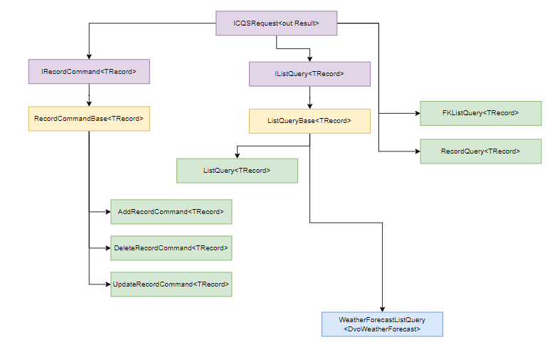
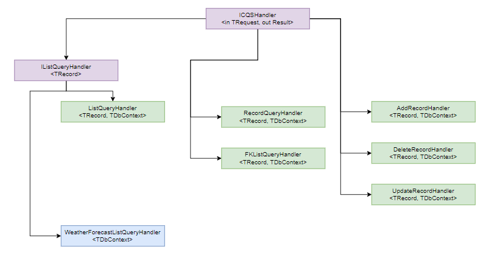

# Building A Succinct DoteNetCore CQS Data Pipeline

The CQS implementations I've seen have always looked incredibly verbose: the number of classes scared me.

I recently had cause to revisit CQS on an application re-write and decided to work on creating a more succinct implementation.  This article is about what I've managed to achieve.

## Test Data

Appendix provides a summary of the data classes and test data provider.  There's a full description in the documents section of the repository.

## Repository

The data repository associated with this is here: [Blazr.Demo.DataPipeline](https://github.com/ShaunCurtis/Blazr.Demo.DataPipeline).  There's some extra documents in the repository on design and detail on the data classes, test data provider and database context. 

The implementation is used in my demo Blazor application which is here: [Blazr.Demo](https://github.com/ShaunCurtis/Blazr.Demo).

## The CQS Pattern

CQS - not to be confused with CQRS - is fundimentally a programming style.  Every action is either:

1. A *Command* - a request to make a data change.
2. A *Query* - a request to get some data.

A *Command* returns either status information or nothing.  CQS stipulates it **NEVER** returns a data set.

A *Query* returns a data set.  CQS defines it **NEVER** makes makes changes to the state of the data.  Ther are no **NO SIDE EFFECTS** to the owning object.

It's a good pattern to apply universally across your code: I do.

Smaller projects tend to avoid the CQS Data pipeline framework: too complicated because the demo implementations contain a lot of classes.

Each action has a *Command/Query* class that defines the action and a *Handler* class to execute the defined action.  Normally a one-to-one relationship: a unique handler for every request.

In essence:

- A *Request* object defines the information a *Handler* needs to execute the request and what it expects in return - the *Result* .

- A *Handler* object executes the necessary code and returns the defined *Result* using data provided by the *Request*.  

Conceptually it's very simple, and relatively easy to implement.  The problem is most implementations are very verbose.  A request and a handler for every single database action. Lots of classes repeating the same old code.  Here's an example:


*Sincere apologies if you recognise this as your code!  I searched Google for an example and your article was high in the search results.*

## Basic Interfaces and Classes

The basic methodology can be defined by two generic interfaces.

`ICQSRequest` defines any request:

1. It says the request produces an output defined as `TResult`.
2. It has a unique `TransactionId` to track the transaction (if required and implemented).

```csharp
public interface ICQSRequest<out TResult>
{
    public Guid TransactionId { get;}
}
```

`ICQSHandler` defines any handler that executes an `ICQSRequest` instance:

1. The handler gets a `TRequest` which implements the `ICQSRequest` interface.
2. The handler outputs a `TResult` as defined in the `ICQSRequest` interface.
3. It has a single `ExecuteAsync` method that returns `TResult`.

```csharp
public interface ICQSHandler<in TRequest, out TResult>
    where TRequest : ICQSRequest<TResult>
{
    TResult ExecuteAsync();
}
```

## A Classic Implementation

Here's a classic implementation to add a `WeatherForecast` record.

`AddWeatherForecastCommand` is the request :

```csharp
public class AddWeatherForecastCommand
    : ICQSRequest<ValueTask<CommandResult>>
{
    public DboWeatherForecast Record { get; private set; } = default!;

    public AddWeatherForecastCommand(DboWeatherForecast record)
        => this.Record = record;
}
```

`AddWeatherForecastHandler` is the handler:

```csharp
public class AddWeatherForecastHandler
    : ICQSHandler<AddWeatherForecastCommand, ValueTask<CommandResult>>
{
    protected readonly IWeatherDbContext dbContext;
    protected readonly AddWeatherForecastCommand command;

    public AddWeatherForecastHandler(IWeatherDbContext dbContext, AddWeatherForecastCommand command)
    {
        this.command = command;
        this.dbContext = dbContext;
    }

    public async ValueTask<CommandResult> ExecuteAsync()
    {
        if (command.Record is not null)
            this.dbContext.DboWeatherForecast.Add(this.command.Record);

        return await dbContext.SaveChangesAsync() == 1
            ? new CommandResult(Guid.Empty, true, "Record Saved")
            : new CommandResult(Guid.Empty, false, "Error saving Record");
    }
}
```

## A Succinct Implementation

To build a more succinct implementation we need some help and accept that we can't cover every request:

 - The 80/20 rule.  Not every request can be fulfilled with our our standard implementation, but 80% is a lot of effort and classes to save on.
 - We need a "compliant" generics based ORM to interface with our data store.  This implementation uses *Entity Framework* which provides that. 
 - There will be some quite complicated generics implemented in the base classes to abstract functionality into boilerplate code.


## Results

Before diving into requests and handlers, we need a set of standard results they return: `TResult` of the request.  Each is a `record` and contains status information and, if a request, the data set.  They are used in Web APIs so must be serializable.  They are shown below and need no explanation.

```csharp
public record ListProviderResult<TRecord>
{
    public IEnumerable<TRecord> Items { get; init; }
    public int TotalItemCount { get; init; }
    public bool Success { get; init; }
    public string? Message { get; init; }
    //....Constructors
}
```
```csaharp
public record RecordProviderResult<TRecord>
{
    public TRecord? Record { get; init; }
    public bool Success { get; init; }
    public string? Message { get; init; }
    //....Constructors
}
```
```csaharp
public record CommandResult
{
    public Guid NewId { get; init; }
    public bool Success { get; init; }
    public string Message { get; init; }
    //....Constructors
}
```
```csaharp
public record FKListProviderResult
{
    public IEnumerable<IFkListItem> Items { get; init; }
    public bool Success { get; init; }
    public string? Message { get; init; }
    //....Constructors
}
```

## Base Classes

`TRecord` represents the data classes retrieved from the data store using the ORM.  It's qualified as a `class` that implements an empty constructor `new()`.

The Request interface/class structure looks like this:



And the Handler interface/class structure looks like this:




### Commands

All commands:

1. Take a record which we define as `TRecord`.
2. Fix `TResult` as an async `ValueTask<CommandResult>`.

First an interface that implements `ICQSRequest` and this functionality.

```csharp
public interface IRecordCommand<TRecord> 
    : ICQSRequest<ValueTask<CommandResult>>
{
    public TRecord Record { get;}
}
```

And an abstract implementation.

```csharp
public abstract class RecordCommandBase<TRecord>
     : IRecordCommand<TRecord>
{
    public Guid TransactionId { get; } = Guid.NewGuid(); 
    public TRecord Record { get; protected set; } = default!;

    public RecordCommandBase(TRecord record)
        => this.Record = record;
}
```

We can now define our Add/Delete/Update specific commands.

```csharp
public class AddRecordCommand<TRecord>
     : RecordCommandBase<TRecord>
{
    public AddRecordCommand(TRecord record) : base(record) {}
}
```
```csharp
public class DeleteRecordCommand<TRecord>
     : RecordCommandBase<TRecord>
{
    public DeleteRecordCommand(TRecord record) : base(record) {}
}
```
```csharp
public class UpdateRecordCommand<TRecord>
     : RecordCommandBase<TRecord>
{
    public UpdateRecordCommand(TRecord record) : base(record) {}
}
```

We need a one-to-one relationship (requests -> handlers) so we define a handler for each type of command.

### The Handlers

There's no benefit in creating interfaces or base classes for handlers so we implement Create/Update/Delete commands as three separate classes.  `TRecord` defines the record class and `TDbContext` the `DbContext` used in the DI `DbContextFactory`.

We use the built in generic methods in `DbContext`, so don't need the specific `DbContext`.   `Set<TRecord>` method finds the `DbSet` instances of `TRecord` and `Update<TRecord>`, `Add<TRecord>` and `Delete<TRecord>` methods with `SaveChangesAsync` implement the commands. 

All the handlers follow the same pattern.

1. The constructor passes in the DbContext factory and the command request to execute.
2. `Execute`:
   1. Gets a DbContext.
   2. Calls the generic `Add/Update/Delete` on the context passing in the record.  Internally EF finds the recordset and the specific record and replaces it with the one supplied.
   3. Calls `SaveChanges` on the DbContext that commits the changes to the data store.
   4. Checks we have one change and returns a `CommandResult`.

This is the Add Handler:

```csharp
public class AddRecordCommandHandler<TRecord, TDbContext>
    : ICQSHandler<AddRecordCommand<TRecord>, ValueTask<CommandResult>>
    where TDbContext : DbContext
    where TRecord : class, new()
{
    protected IDbContextFactory<TDbContext> factory;
    protected readonly AddRecordCommand<TRecord> command;

    public AddRecordCommandHandler(IDbContextFactory<TDbContext> factory, AddRecordCommand<TRecord> command)
    {
        this.command = command;
        this.factory = factory;
    }

    public async ValueTask<CommandResult> ExecuteAsync()
    {
        using var dbContext = factory.CreateDbContext();
        dbContext.Add<TRecord>(command.Record);
        return await dbContext.SaveChangesAsync() == 1
            ? new CommandResult(Guid.Empty, true, "Record Saved")
            : new CommandResult(Guid.Empty, false, "Error saving Record");
    }
}
``` 

## Queries

Moving on to queries which aren't quite so uniform.

1. There are various types of `TResult`.
2. They have specific *Where* and *OrderBy* requirements.

To handle these requirements we define three Query requests:

### RecordQuery

This returns a `RecordProviderResult` containing a single record based on a provided Uid.

```csharp
public record RecordQuery<TRecord>
    : ICQSRequest<ValueTask<RecordProviderResult<TRecord>>>
{
    public Guid TransactionId { get; } = Guid.NewGuid();
    public readonly Guid? RecordId;

    public RecordQuery(Guid? recordId)
        => this.RecordId = recordId;
}
```

### ListQuery

This returns a `ListProviderResult` containing a *paged* `IEnumerable` of `TRecord`.

We define an interface:

```
public interface IListQuery<TRecord>
    : ICQSRequest<ValueTask<ListProviderResult<TRecord>>>
    where TRecord : class, new()
{
    public int StartIndex { get; }
    public int PageSize { get; }
    public string? SortExpressionString { get; }
    public string? FilterExpressionString { get; }
}
```

A base abstract implementation:

```csharp
public abstract record ListQueryBase<TRecord>
    :IListQuery<TRecord>
    where TRecord : class, new()
{
    public int StartIndex { get; init; }
    public int PageSize { get; init; }
    public string? SortExpressionString { get; init; }
    public string? FilterExpressionString { get; init; }
    public Guid TransactionId { get; init; } = Guid.NewGuid();

    public ListQueryBase() { }

    public ListQueryBase(ListProviderRequest<TRecord> request)
    {
        this.StartIndex = request.StartIndex;
        this.PageSize = request.PageSize;
        this.SortExpressionString = request.SortExpressionString;
        this.FilterExpressionString = request.FilterExpressionString;
    }
}
```

And finally a generic query:

```csharp
public record ListQuery<TRecord>
    :ListQueryBase<TRecord>
    where TRecord : class, new()
{
    public ListQuery() { }

    public ListQuery(ListProviderRequest<TRecord> request)
        :base(request) { }
}
```

We use the interface/abstract base class pattern because we need to implement custom List queries.  If these inherit from `ListQuery`, we run into issues with factories and pattern methods.  Using a base class to implement the bolierplate code solves this problem.

### FKListQuery

This returns a `FkListProviderResult` containing an `IEnumerable` of `IFkListItem`.  `FkListItem` is a simple object containing a *Guid/Name* pair.  It's principle use is in foreign key *Select* controls in the UI.

```csharp
public record FKListQuery<TRecord>
    : ICQSRequest<ValueTask<FKListProviderResult>>
{
    public Guid TransactionId { get; } = Guid.NewGuid();
}
```

## Handlers

The corresponding query handlers are:

### RecordQueryHandler

Creating a "generic" version can be challenging depending on the ORM.

The key concepts to note are:

1. The use of *unit of work* `DbContexts` from the `IDbContextFactory`.
2. `_dbContext.Set<TRecord>()` gets the `DbSet` for `TRecord`.
3. The use of two methodologies to apply the query.  

```csharp
public class RecordQueryHandler<TRecord, TDbContext>
    : ICQSHandler<RecordQuery<TRecord>, ValueTask<RecordProviderResult<TRecord>>>
        where TRecord : class, new()
        where TDbContext : DbContext
{
    private readonly RecordQuery<TRecord> _query;
    private IDbContextFactory<TDbContext> _factory;
    private bool _success = true;
    private string _message = string.Empty;

    public RecordQueryHandler(IDbContextFactory<TDbContext> factory, RecordQuery<TRecord> query)
    {
        _factory = factory;
        _query = query;
    }

    public async ValueTask<RecordProviderResult<TRecord>> ExecuteAsync()
    {
        var dbContext = _factory.CreateDbContext();
        dbContext.ChangeTracker.QueryTrackingBehavior = QueryTrackingBehavior.NoTracking;

        TRecord? record = null;

        // first check if the record implements IRecord.  If so we can do a cast and then do the query via the Uid property directly 
        if ((new TRecord()) is IRecord)
            record = await dbContext.Set<TRecord>().SingleOrDefaultAsync(item => ((IRecord)item).Uid == _query.GuidId);

        // Try and use the EF FindAsync implementation
        if (record == null)
        {
            if (_query.GuidId != Guid.Empty)
                record = await dbContext.FindAsync<TRecord>(_query.GuidId);

            if (_query.LongId > 0)
                record = await dbContext.FindAsync<TRecord>(_query.LongId);

            if (_query.IntId > 0)
                record = await dbContext.FindAsync<TRecord>(_query.IntId);
        }

        if (record is null)
        {
            _message = "No record retrieved";
            _success = false;
        }

        return new RecordProviderResult<TRecord>(record, _success, _message);
    }
}
```

### ListQueryHandler

The key concepts to note here are:

1. The use of *unit of work* `DbContexts` from the `IDbContextFactory`.
2. `_dbContext.Set<TRecord>()` to get the `DbSet` for `TRecord`.
3. The use of `IQueryable` to build queries.
4. The need for two queries.  One to get the "paged" recordset and one to get the total record count.

```csharp
public class ListQueryHandler<TRecord, TDbContext>
    : IListQueryHandler<TRecord>
        where TDbContext : DbContext
        where TRecord : class, new()
{
    protected IEnumerable<TRecord> items = Enumerable.Empty<TRecord>();
    protected int count = 0;

    protected IDbContextFactory<TDbContext> factory;
    protected IListQuery<TRecord> listQuery = default!;

    public ListQueryHandler(IDbContextFactory<TDbContext> factory)
    {
        this.factory = factory;
    }

    public ListQueryHandler(IDbContextFactory<TDbContext> factory, IListQuery<TRecord> query)
    {
        this.factory = factory;
        this.listQuery = query;
    }

    public async ValueTask<ListProviderResult<TRecord>> ExecuteAsync()
    {
        if (this.listQuery is null)
            return new ListProviderResult<TRecord>(new List<TRecord>(), 0, false, "No Query Defined");

        if (await this.GetItemsAsync())
            await this.GetCountAsync();

        return new ListProviderResult<TRecord>(this.items, this.count);
    }

    public async ValueTask<ListProviderResult<TRecord>> ExecuteAsync(IListQuery<TRecord> query)
    {
        if (query is null)
            return new ListProviderResult<TRecord>(new List<TRecord>(), 0, false, "No Query Defined");

        listQuery = query;

        if (await this.GetItemsAsync())
            await this.GetCountAsync();

        return new ListProviderResult<TRecord>(this.items, this.count);
    }

    protected virtual async ValueTask<bool> GetItemsAsync()
    {
        var dbContext = this.factory.CreateDbContext();
        dbContext.ChangeTracker.QueryTrackingBehavior = QueryTrackingBehavior.NoTracking;

        IQueryable<TRecord> query = dbContext.Set<TRecord>();

        if (listQuery.FilterExpressionString is not null)
            query = query
                .Where(listQuery.FilterExpressionString)
                .AsQueryable();

        if (listQuery.SortExpressionString is not null)
            query = query.OrderBy(listQuery.SortExpressionString);

        if (listQuery.PageSize > 0)
            query = query
                .Skip(listQuery.StartIndex)
                .Take(listQuery.PageSize);

        if (query is IAsyncEnumerable<TRecord>)
            this.items = await query.ToListAsync();
        else
            this.items = query.ToList();

        return true;
    }

    protected virtual async ValueTask<bool> GetCountAsync()
    {
        var dbContext = this.factory.CreateDbContext();
        dbContext.ChangeTracker.QueryTrackingBehavior = QueryTrackingBehavior.NoTracking;

        IQueryable<TRecord> query = dbContext.Set<TRecord>();

        if (listQuery.FilterExpressionString is not null)
            query = query
                .Where(listQuery.FilterExpressionString)
                .AsQueryable();

        if (query is IAsyncEnumerable<TRecord>)
            count = await query.CountAsync();
        else
            count = query.Count();

        return true;
    }
}
```

### FKListQueryHandler

```csharp
public class FKListQueryHandler<TRecord, TDbContext>
    : ICQSHandler<FKListQuery<TRecord>, ValueTask<FKListProviderResult>>
        where TDbContext : DbContext
        where TRecord : class, IFkListItem, new()
{
    protected IEnumerable<TRecord> items = Enumerable.Empty<TRecord>();
    protected IDbContextFactory<TDbContext> factory;
    protected readonly FKListQuery<TRecord> listQuery;

    public FKListQueryHandler(IDbContextFactory<TDbContext> factory, FKListQuery<TRecord> query)
    {
        this.factory = factory;
        this.listQuery = query;
    }

    public async ValueTask<FKListProviderResult> ExecuteAsync()
    {
        var dbContext = this.factory.CreateDbContext();
        if (listQuery is null)
            return new FKListProviderResult(Enumerable.Empty<IFkListItem>(), false, "No Query defined");

        IEnumerable<TRecord> dbSet = await dbContext.Set<TRecord>().ToListAsync();
        return new FKListProviderResult(dbSet);
    }
}
```

## The Generic Factory Broker

We can now define a factory interface and class to abstract the execution of *Requests* against their respective *Handlers*.  I call these *Brokers*.

The intention is to code the broker so calls to `ExecuteAsync` with a request object will execute the request against it's defined handler and provide the expected result.

```csharp
var TResult = await DataBrokerInstance.ExecuteAsync<TRecord>(TRequest);
```

First we define an interface:

```csharp
public interface ICQSDataBroker
{    
    public ValueTask<CommandResult> ExecuteAsync<TRecord>(AddRecordCommand<TRecord> command) where TRecord : class, new();
    public ValueTask<CommandResult> ExecuteAsync<TRecord>(UpdateRecordCommand<TRecord> command) where TRecord : class, new();
    public ValueTask<CommandResult> ExecuteAsync<TRecord>(DeleteRecordCommand<TRecord> command) where TRecord : class, new();
    public ValueTask<ListProviderResult<TRecord>> ExecuteAsync<TRecord>(ListQuery<TRecord> query) where TRecord : class, new();
    public ValueTask<RecordProviderResult<TRecord>> ExecuteAsync<TRecord>(RecordQuery<TRecord> query) where TRecord : class, new();
    public ValueTask<FKListProviderResult> ExecuteAsync<TRecord>(FKListQuery<TRecord> query) where TRecord : class, IFkListItem, new();
}
```

And a *Server* Broker implementation:

```csharp
public class CQSDataBroker<TDbContext>
    :ICQSDataBroker
    where TDbContext : DbContext
{
    private readonly IDbContextFactory<TDbContext> _factory;
    private readonly IServiceProvider _serviceProvider;

    public CQSDataBroker(IDbContextFactory<TDbContext> factory, IServiceProvider serviceProvider)
    { 
        _factory = factory;
        _serviceProvider = serviceProvider;
    }

    public async ValueTask<CommandResult> ExecuteAsync<TRecord>(AddRecordCommand<TRecord> command) where TRecord : class, new()
    {
        var handler = new AddRecordCommandHandler<TRecord, TDbContext>(_factory, command);
        var result = await handler.ExecuteAsync();
        return result;
    }

    //.... Update and Delete ExecuteAsyncs

    public async ValueTask<ListProviderResult<TRecord>> ExecuteAsync<TRecord>(ListQuery<TRecord> query) where TRecord : class, new()
    {
        var handler = new ListQueryHandler<TRecord, TDbContext>(_factory, query);
        var result = await handler.ExecuteAsync();
        return result;
    }

    public async ValueTask<RecordProviderResult<TRecord>> ExecuteAsync<TRecord>(RecordQuery<TRecord> query) where TRecord : class, new()
    {
        var handler = new RecordQueryHandler<TRecord, TDbContext>(_factory, query);
        var result = await handler.ExecuteAsync();
        return result;
    }

    public async ValueTask<FKListProviderResult> ExecuteAsync<TRecord>(FKListQuery<TRecord> query) where TRecord : class, IFkListItem, new()
    {
        var handler = new FKListQueryHandler<TRecord, TDbContext>(_factory, query);
        var result = await handler.ExecuteAsync();
        return result;
    }

    public ValueTask<object> ExecuteAsync<TRecord>(object query)
        => throw new NotImplementedException();
}
```

Note that there's a catch all method defined that throws an expection. 

### Custom Requests

I'll use filtering the WeatherForecast list on the Location here to demonstrate how to customize the code: it's probably the most common custom requirement. 

`IListQuery` and `ListQueryBase` has everything we need to the location Id.  

Our custom query:

```csharp
public record WeatherForecastListQuery
    : ListQueryBase<DvoWeatherForecast>
{
    public Guid? WeatherLocationId { get; init; }

    public WeatherForecastListQuery()
    : base()
        => WeatherLocationId = Guid.Empty;


    public WeatherForecastListQuery(Guid? weatherLocationId, ListProviderRequest<DvoWeatherForecast> request)
        : base(request)
    {
        if (weatherLocationId is not null && weatherLocationId != Guid.Empty)
            WeatherLocationId = weatherLocationId;
    }

    public WeatherForecastListQuery(ListProviderRequest<DvoWeatherForecast> request)
        :base(request)
        => WeatherLocationId = Guid.Empty;
}
```

And the handler built on the same pattern as generic handler:

```csharp
public class WeatherForecastListQueryHandler<TDbContext>
    : IListQueryHandler<DvoWeatherForecast>
        where TDbContext : DbContext
{
    protected IEnumerable<DvoWeatherForecast> items = Enumerable.Empty<DvoWeatherForecast>();
    protected int count = 0;

    protected IDbContextFactory<TDbContext> factory;
    protected WeatherForecastListQuery listQuery = default!;

    public WeatherForecastListQueryHandler(IDbContextFactory<TDbContext> factory)
    {
        this.factory = factory;
    }

    public async ValueTask<ListProviderResult<DvoWeatherForecast>> ExecuteAsync(IListQuery<DvoWeatherForecast> query)
    {
        if (query is null || query is not WeatherForecastListQuery)
            return new ListProviderResult<DvoWeatherForecast>(new List<DvoWeatherForecast>(), 0, false, "No Query Defined");

        listQuery = (WeatherForecastListQuery)query;

        if (await this.GetItemsAsync())
            await this.GetCountAsync();

        return new ListProviderResult<DvoWeatherForecast>(this.items, this.count);
    }

    protected virtual async ValueTask<bool> GetItemsAsync()
    {
        var dbContext = this.factory.CreateDbContext();
        dbContext.ChangeTracker.QueryTrackingBehavior = QueryTrackingBehavior.NoTracking;

        IQueryable<DvoWeatherForecast> query = dbContext.Set<DvoWeatherForecast>();

        if (listQuery.WeatherLocationId is not null && listQuery.WeatherLocationId != Guid.Empty)
            query = query
                .Where(item => item.WeatherLocationId == listQuery.WeatherLocationId)
                .AsQueryable();

        if (listQuery.SortExpressionString is not null)
            query = query.OrderBy(listQuery.SortExpressionString);

        if (listQuery.PageSize > 0)
            query = query
                .Skip(listQuery.StartIndex)
                .Take(listQuery.PageSize);

        if (query is IAsyncEnumerable<DvoWeatherForecast>)
            this.items = await query.ToListAsync();
        else
            this.items = query.ToList();

        return true;
    }

    protected virtual async ValueTask<bool> GetCountAsync()
    {
        var dbContext = this.factory.CreateDbContext();
        dbContext.ChangeTracker.QueryTrackingBehavior = QueryTrackingBehavior.NoTracking;

        IQueryable<DvoWeatherForecast> query = dbContext.Set<DvoWeatherForecast>();

        if (listQuery.WeatherLocationId is not null && listQuery.WeatherLocationId != Guid.Empty)
            query = query
                .Where(item => item.WeatherLocationId == listQuery.WeatherLocationId)
                .AsQueryable();

        if (query is IAsyncEnumerable<DvoWeatherForecast>)
            count = await query.CountAsync();
        else
            count = query.Count();

        return true;
    }
}
```

We can now take advantage of DI and define a transient DI service for our handler:

```csharp
services.AddTransient<IListQueryHandler<DvoWeatherForecast>, WeatherForecastListQueryHandler<InMemoryWeatherDbContext>>();
```
And get this service like this in our broker:

```csharp
var handler = ServiceProviderInstance.GetService<IListQueryHandler<TRecord>>();
```

We can only define one `IListQueryHandler` per data class using thia methodology, but we can code the query and handler to handle different types of query.

We define this in `ICQSDataBroker`: 

```csharp
public interface ICQSDataBroker
{
    public ValueTask<ListProviderResult<TRecord>> ExecuteAsync<TRecord>(IListQuery<TRecord> query) where TRecord : class, new();
}
```

And implement it in `CQSDataBroker`.  

```csharp
public class CQSDataBroker<TDbContext>
    :ICQSDataBroker
    where TDbContext : DbContext
{
    private readonly IDbContextFactory<TDbContext> _factory;
    private readonly IServiceProvider _serviceProvider;

    public CQSDataBroker(IDbContextFactory<TDbContext> factory, IServiceProvider serviceProvider)
    { 
        _factory = factory;
        _serviceProvider = serviceProvider;
    }

    public async ValueTask<ListProviderResult<TRecord>> ExecuteAsync<TRecord>(IListQuery<TRecord> query) where TRecord : class, new()
    {
        var queryType = query.GetType();
        var handler = _serviceProvider.GetService<IListQueryHandler<TRecord>>();
        if (handler == null)
            throw new NullReferenceException("No Handler service registed for the List Query");

        var result = await handler.ExecuteAsync(query);
        return result;
    }
    //.... other ExecuteAsyncs
}
```

## Testing

I'm using testing to demostrate the pipeline.

Here's the setup for the Broker tests.

```csharp
public CQSBrokerTests()
    // Creates an instanc of the Test Data provider
    => _weatherTestDataProvider = WeatherTestDataProvider.Instance();

private ServiceProvider GetServiceProvider()
{
    // Creates a Service Collection
    var services = new ServiceCollection();

    // Adds the application services to the collection
    Action<DbContextOptionsBuilder> dbOptions = options => options.UseInMemoryDatabase($"WeatherDatabase-{Guid.NewGuid().ToString()}");
    services.AddDbContextFactory<TDbContext>(options);
    services.AddSingleton<ICQSDataBroker, CQSDataBroker<InMemoryWeatherDbContext>>();
    services.AddTransient<IListQueryHandler<DvoWeatherForecast>, WeatherForecastListQueryHandler<InMemoryWeatherDbContext>>();

    // Creates a Service Provider from the Services collection
    // This is our DI container
    var provider = services.BuildServiceProvider();

    // Adds the test data to the in memory database
    var factory = provider.GetService<IDbContextFactory<InMemoryWeatherDbContext>>();
    if (factory is not null)
        WeatherTestDataProvider.Instance().LoadDbContext<InMemoryWeatherDbContext>(factory);

    return provider!;
}
```

Each test sets up it's own DI service container, and adds the application services to it.

Here's a typical test to get a list of Weather Locations:

```csharp
[Fact]
public async void TestWeatherLocationListCQSDataBroker()
{
    // Build our DI container
    var provider = GetServiceProvider();
    //Get the Data Broker
    var broker = provider.GetService<ICQSDataBroker>()!;

    // Get the control record count from the Test Data Provider
    var testRecordCount = _weatherTestDataProvider.WeatherLocations.Count();
    int pageSize = 10;
    // Get the expected recordset count.
    // It should be either the page size or the total record count if that's smaller
    var testCount = testRecordCount > pageSize ? pageSize : testRecordCount ;

    // Create a list request
    var listRequest = new ListProviderRequest<DboWeatherLocation>(0, pageSize);

    // Create a ListQuery and execute the query on the Data Broker against the DboWeatherLocation recordset
    var query = new ListQuery<DboWeatherLocation>(listRequest);
    var result = await broker.ExecuteAsync<DboWeatherLocation>(query);

    // Check we have success
    Assert.True(result.Success);
    // Check the recordset count
    Assert.Equal(testCount, result.Items.Count());
    // Check the total count os correct against the test provider
    Assert.True(result.TotalItemCount == testRecordCount);
}
```

Here's a very simplar test, but using the custom WeatherForecast query to filter the results:

```csharp
[Fact]
public async void TestFilteredDvoWeatherForecastListCQSDataBroker()
{
    var provider = GetServiceProvider();
    var broker = provider.GetService<ICQSDataBroker>()!;
    var locationId = _weatherTestDataProvider.WeatherLocations.First().Uid;
    var testRecordCount = _weatherTestDataProvider.WeatherForecasts.Where(item => item.WeatherLocationId == locationId).Count();
    int pageSize = 10;
    var testCount = testRecordCount > pageSize ? pageSize : testRecordCount;

    var listRequest = new ListProviderRequest<DvoWeatherForecast>(0, pageSize);

    var query = new WeatherForecastListQuery(locationId,listRequest);
    var result = await broker.ExecuteAsync<DvoWeatherForecast>(query);

    Assert.True(result.Success);
    Assert.Equal(testCount, result.Items.Count());
    Assert.True(result.TotalItemCount == testRecordCount);
}
```

And finally a Add command Test:

```csharp
[Fact]
public async void TestAddCQSDataBroker()
{
    var provider = GetServiceProvider();
    var broker = provider.GetService<ICQSDataBroker>()!;

    var newRecord = _weatherTestDataProvider.GetForecast();
    var id = newRecord!.Uid;

    var command = new AddRecordCommand<DboWeatherForecast>(newRecord);
    var result = await broker.ExecuteAsync(command);

    var query = new RecordQuery<DboWeatherForecast>(id);
    var checkResult = await broker.ExecuteAsync(query);

    Assert.True(result.Success);
    Assert.Equal(newRecord, checkResult.Record);
}
```

## Summary

Hopefully I demonstrated a different, more succinct approach to implementing the CQS pattern.  I'm now the converted.  It's replaced my old repository pattern code.

## Appendix

### The Data Store

The backend database for this article and repository is an In-Memory Entity Framework database.  It's main advantage over other methods of mocking a data store is it works with the DbContext factory and supports multiple contexts.  I use In-Memory queries to emulate views.

The TestDataProvider has a method that populates it's data into a DbContext.

The full DbContext looks like this:

```csharp
public class InMemoryWeatherDbContext
    : DbContext
{
    public DbSet<DboWeatherForecast> DboWeatherForecast { get; set; } = default!;
    public DbSet<DvoWeatherForecast> DvoWeatherForecast { get; set; } = default!;
    public DbSet<DboWeatherSummary> DboWeatherSummary { get; set; } = default!;
    public DbSet<DboWeatherLocation> DboWeatherLocation { get; set; } = default!;
    public DbSet<FkWeatherSummary> FkWeatherSummary { get; set; } = default!;
    public DbSet<FkWeatherLocation> FkWeatherLocation { get; set; } = default!;

    public InMemoryWeatherDbContext(DbContextOptions<InMemoryWeatherDbContext> options) : base(options) { }

    protected override void OnModelCreating(ModelBuilder modelBuilder)
    {
        modelBuilder.Entity<DboWeatherForecast>().ToTable("WeatherForecast");
        modelBuilder.Entity<DboWeatherSummary>().ToTable("WeatherSummary");
        modelBuilder.Entity<DboWeatherLocation>().ToTable("WeatherLocation");

        modelBuilder.Entity<DvoWeatherForecast>()
            .ToInMemoryQuery(()
            => from f in this.DboWeatherForecast
               join s in this.DboWeatherSummary! on f.WeatherSummaryId equals s.Uid into fs
               from fsjoin in fs
               join l in this.DboWeatherLocation! on f.WeatherLocationId equals l.Uid into fl
               from fljoin in fl
               select new DvoWeatherForecast
               {
                   Uid = f.Uid,
                   WeatherSummaryId = f.WeatherSummaryId,
                   WeatherLocationId = f.WeatherLocationId,
                   Date = f.Date,
                   Summary = fsjoin.Summary,
                   Location = fljoin.Location,
                   TemperatureC = f.TemperatureC,
               })
            .HasKey(x => x.Uid);

        modelBuilder.Entity<FkWeatherSummary>()
            .ToInMemoryQuery(()
            => from s in this.DboWeatherSummary!
               select new FkWeatherSummary
               {
                   Id =s.Uid,
                   Name = s.Summary
               })
            .HasKey(x => x.Id);

        modelBuilder.Entity<FkWeatherLocation>()
            .ToInMemoryQuery(()
            => from l in this.DboWeatherLocation!
               select new FkWeatherLocation
               {
                   Id = l.Uid,
                   Name = l.Location
               })
            .HasKey(x => x.Id);
    }
}
```

